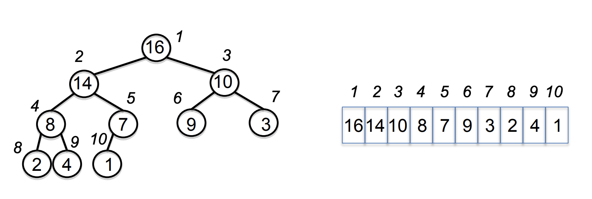

---
tag:
- heap
- heap sort
title: MIT-6.006 Intoduction to Algorithms - Lecture4(Heaps and heap sort)
slug: heaps
date: 2021-07-18T15:00:00Z
excerpt: MIT 6.006 Lecture 4 Heaps and heap sort
image: "../images/6-006f11.jpg"

---
## 우선순위 큐(Priority Queue)

아래의 연산을 지원하는, 모든 요소가 관련된 key를 갖는 set `S` 를 표현하는 데이터 구조

* `insert(S, x)` : set `S` 에 element `x` 를 삽입
* `max(S)` : S중 가장 큰 key를 갖는 값을 반환
* `extract_max(S)` : S에서 가장 큰 key값을 갖는 element를 반환하고 해당 값을 `S` 에서 제거
* `increase_key(S, x, k)` : `x` 의 key값을 새로운 값 `k` 로 증가 시킴(`k` 가 `x` 보다 크거나 같다고 가정)

## Heap

* Heap은 우선순위 큐를 구현한 자료구조로 거의 완전한 이진 트리(Nearly complete binary tree) 형태를 가짐
* **Max Heap Property** : 임의의 노드의 key값은 해당 노드의 자식들의 key값 보다 항상 크거나 같다.(Min heap은 반대)

  

## Heap as a Tree

* `Root of tree` : 배열의 첫 요소, i = 1
* `parent(i)` = `i / 2` : node의 부모 인덱스
* `left(i)` = `2 * i` : node의 왼쪽 자식 인덱스
* `right(i)` = `2 * i + 1` : node의 오른쪽 자식 인덱스

## Heap Operations

* `buildMaxHeap` : 정렬되지 않은 배열을 이용해 max-heap을 만듦
* `maxheapify` : root의 subtree에서 단 하나의 heap property 위배 사항을 수정하는 작업

### maxHeapify

* `left(i)` , `right(i)` 을 root로 하는 subtree들은 모두 max-heap이라 가정
* `A[i]` 가 max-heap property를 위배하는 경우 `A[i]` 를 tree를 따라 내려가며 치환해가며 `i` 를 root로 하는 subtree를 max-heap으로 만든다.
* 트리의 높이가 `logn` 이므로 `maxHeapify`의 시간복잡도는 `O(n)` .

### buildMaxHeap(A)

`A[1, ..., n]` 을 max-heap으로 변환해보자. 간단하게 `i = n / 2` 에서부터 1까지 `maxHeapify(A, i)` 를 수행하면 된다.

이 때, `n / 2` 에서 시작하는 이유는 `n / 2 + 1` 부터는 leaf이므로 이미 max-heap인 상태이기 때문에 작업이 필요가 없다.

따라서 1 \~ `n / 2` 까지의 모든 노드에 대해서 `maxHeapify` 를 수행할 때 단순하게 복잡도를 계산하면 `O(nlogn)` 이 된다.

### 좀 더 제대로 복잡도를 분석해보면?

leaves로 부터 한 레벨 위의 노드들에 대해서는 `maxHeapify` 가 `O(1)` 의 시간 복잡도를 가진다. 직관적으로 생각해 보면 노드의 레벨이 올라갈 수록 노드당 해야할 작업은 늘어나지만 노드의 수 자체가 줄어든다.

leaves를 제외한 첫번째 레벨의 노드 수는 `n / 4` 이고 레벨이 올라갈 수록 `n / 8`, `n / 16` , ... `1` 이런식이 될 텐데 전체 작업량을 수식으로 나타내보면 아래와 같다.

`n / 4 * (1 * c) + n / 8 * (2 * c) + n / 16 * (3 * c) + ... + 1 * (logn * c)`

이 때, `n / 4` 를 `2 ^ k` 로 치환하면,

`c * 2^k * (1 / 2 ^ 0 + 2 / 2 ^ 1 + 3 / 2 ^ 2 + ... + (k + 1) / 2 ^ k)`

그런데 괄호 안의 급수를 잘 살펴보면 수렴하는 급수이므로 시간 복잡도를 계산하는데 있어 단순 상수 취급이 가능해지므로 결국 상수 c와 수렴하는 급수를 제외하고 n에 dependent한 부분은 `2 ^ k`, 즉 `n / 4` 만 남게된다. 결국 `buildMaxHeap` 의 정확한 시간복잡도는 `O(n)` 이 된다.

## Heap sort

Heap을 이용한 sorting 전략은 아래와 같다.

1. 정렬되지 않은 배열을 이용해 max-heap을 만든다.(`buildMaxHeap`)
2. max element `A[i]` 를 구한다.
3. `A[i]` 와 `A[n]` 을 swap한다.
4. `n` 번째 노드를 heap에서 제거한다.
5. 바뀐 root는 max-heap property를 만족하지 않으므로 `maxHeapify` 를 수행한다.(root의 자식들은 모두 max-heap이므로)
6. heap이 비어있지 않는한 step2로 돌아가 반복한다.

### 복잡도는?

총 n번의 iteration을 거치면 heap은 모두 비게 되는데, 각 iteration마다 swap과 `maxHeapify` 작업을 수행해야 하므로, `O(logn)` 의 복잡도를 갖는다. 따라서 전체 복잡도는 `O(nlogn)` 이 된다.