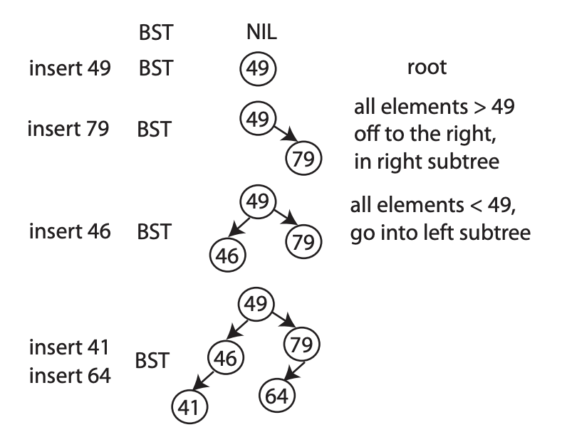
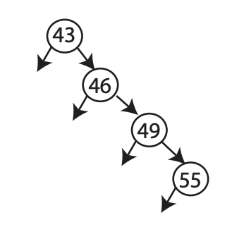

---
tag:
- binary search tree
- bst
title: MIT-6.006 Intoduction to Algorithms - Lecture5(Binary Search Trees, BST Sort)
slug: bst
date: 2021-07-25T15:00:00Z
excerpt: MIT 6.006 Binary Search Trees and BST Sort
image: "../images/6-006f11.jpg"

---
# Binary Search Trees, BST Sort

## Runway Reservation System

* 단일 활주로를 가진 공항을 가정
* 활주로에 대한 착륙 시간을 예약하는 시스템
* 비행기가 착륙하면 착륙예정 이벤트에서 해당 예약을 제거
* 예약은 착륙예정 시간 `t`로 이루어짐
* 예약 요청시간 `t` 전후 `k` 분 이내에 다른 예약이 없는 경우에만 해당 요청을 set에 추가

> 목표: 해당 시스템을 `O(logn)` time에 처리하는 시스템 구현

## 어떤 자료구조를 통해 구현할 수 있을까?

### 1. Sorted Array

먼저 정렬된 배열을 생각해보면 정렬되어 있으므로 binary search를 통해서 해당 요청이 들어갈 자리를 찾을 수 있다.(`logn`)

하지만 위치를 찾은 이후 해당 요청을 array에 삽입할 때 나머지 요소의 shift에 `Θ(n)` 의 작업 필요

### 2. Sorted List

k minute check는 constant time에 처리 가능하지만 insertion point를 찾는데 `O(n)` 이 소요된다.

### 3. Min-heap

요청을 적절한 위치에 삽입하는데는 `O(logn)` 이 소요되지만 k-minute check에 `O(n)` 의 시간이 소요된다.

### 4. Dictionary

삽입에는 `O(1)`, k-minute check에는 `Ω(n)`.

## Binary Search Trees

### 특징

* 모든 노드 x는 key(x)라는 property를 갖는다. 
* root가 아닌 모든 노드는 parent(x) property를 갖는다
* 모든 노드는 left(x) 또는 right(x)의 child property를 가질 수 있다.(heap과 다르게 pointer 존재)
* 모든 노드 x에 대하여, x의 left subtree에 존재하는 노드 y는 key(y) <= key(x)의 특징을 만족한다.
* 반대로 right subtree의 y에 대해서 key(y) >= key(x)를 만족

### Insertion

root에서부터 노드를 따라 내려가며 k-minute check를 해가며 요청이 위치할 자리를 찾는다. k-minute check에 위배되는 node를 만나면 작업을 멈추고 요청에 대한 예약이 불가능한 것으로 처리한다.

### Complexity

BST의 모든 연산은 tree의 높이 `h` 에 해당하는 시간복잡도 `O(h)` 를 갖는다.

### 해치웠나?

Tree의 높이 `h` 는 `O(logn)` 이 되어야 하나 위 그림에서 보면 `h` 는 `O(n)` 이 된다. Balanced BST가 해답이 될 수 있는데 다음 시간에!